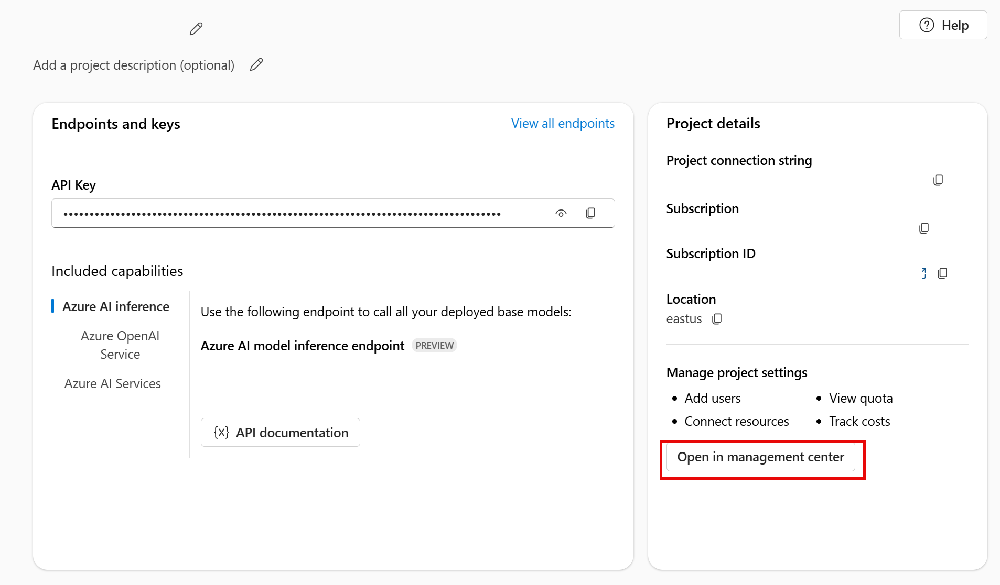
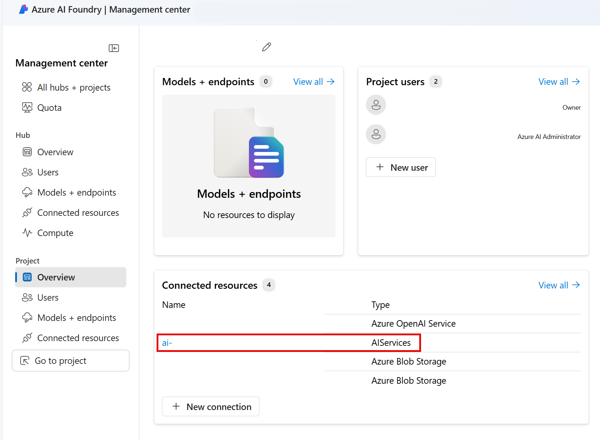
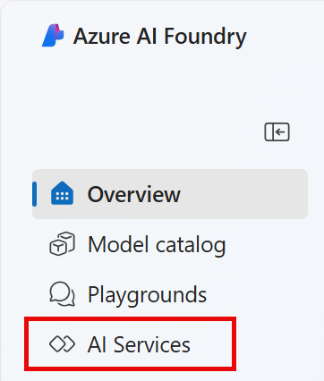

---
lab:
    title: 'Explore Azure AI Services'
---

# Explore Azure AI Services

Azure AI services help users create AI applications with out-of-the-box and pre-built and customizable APIs and models. In this exercise you will take a look at one of the services, Azure AI Content Safety, in Azure AI Foundry portal.

Azure AI Content Safety enables you to moderate text and image content. In this exercise, you will use Azure AI Content Safety in Azure AI Foundry portal, Microsoft's platform for creating intelligent applications, to run tests on sample text or images and get a severity score ranging from safe to high for each category. 

> **Note**
> The goal of this exercise is to get a general sense of how Azure AI services are provisioned and used. Content Safety is used as an example, but you are not expected to gain a comprehensive knowledge of content safety in this exercise!

## Create a project in Azure AI Foundry portal

1. In a browser tab, navigate to the [Azure AI Foundry portal](https://ai.azure.com?azure-portal=true).

2. Sign in with your account. 

3. On the Azure AI Foundry portal home page, select **Create a project**. In Azure AI Foundry, projects are containers that help organize your work.  

    

4. On the *Create a project* pane, you will see a generated project name, which you can keep as-is. Depending on whether you have created a hub in the past, you will either see a list of *new* Azure resources to be created or a drop-down list of existing hubs. If you see the drop-down list of existing hubs, select *Create new hub*, create a unique name for your hub, and select *Next*.  
 
    

> **Important**: You will need an Azure AI services resouce provisioned in a specific location to complete the rest of the lab.

5. In the same *Create a project* pane, select **Customize** and select one of the following **Locations**: East US, France Central, Korea Central, West Europe, or West US to complete the rest of the lab. Then select **create**. 

1. Take note of the resources that are created: 
- Azure AI services
- Azure AI hub
- Azure AI project
- Storage account
- Key vault
- Resource group  

6. After the resources are created, you will be brought to your project's *Overview* page. 

>**Note**: If you are using a Cloud Slice subscription, you can skip steps #7-12 and go to step #13. Otherwise, continue with step #7.

7. Under *Project details*, select **Open in management center**. 

8. In the project management center, under *connected resources* select the *AI services* resource you just created. Then select the resource under *Connection details*. You will be taken to your resource in the Azure portal. 

  
9. In the Azure portal, on the left-hand pane, select **Access Control (IAM)**. Then on the open pane, select **Add** next to the plus sign, and select **Add role assignment**. 

10. Search for **Cognitive Services User** in the list of roles, and select it. Then select **Next**. 

11. Use the following settings to assign yourself to the role: 
    - **Assign access to**: select *user, group, or service principal*
    - **Members**: click on *select members*
        - On the open *Select members* pane, find your name. Click on the plus icon next to your name. Then click **Select**.
    - **Description**: *leave blank*

12. Select **Review and Assign**, then select **Review and Assign** again to add the role assignment.    

13. In your browser, return to the [Azure AI Foundry portal](https://ai.azure.com?azure-portal=true). Select your project. 

14. On the left-hand menu on the screen, select **AI Services**.
 
      

15. On the *AI Services* page, select the *Vision + Document* tile to try out Azure AI Vision and Document capabilities.
    
    

## Try out text moderation with Content Safety in Azure AI Foundry portal 

1. On the *Content Safety* page, under *Filter text content*, select **Moderate text content**.

2. Under run a simple test, click **Safe Content**. Notice that text is displayed in the box below. 

3. Click **Run test**. Running a test calls the Content Safety Service's deep learning model. The deep learning model has already been trained to recognize un-safe content.

4. In the *Results* panel, inspect the results. There are four severity levels from safe to high, and four types of harmful content. Does the Content Safety AI service consider this sample to be acceptable or not? What's important to note is that the results are within a confidence interval. A well-trained model, like one of Azure AI's out-of-the-box models, can return results that have a high probability of matching what a human would label the result. Each time you run a test, you call the model again. 

5. Now try another sample. Select the text under Violent content with misspelling. Check that the content is displayed in the box below.

6. Click **Run test** and inspect the results in the Results panel again. 

You can run tests on all the samples provided, then inspect the results.

## Check out the keys and endpoint

These capabilities you tested can be programmed into all sorts of applications. The keys and endpoint used for application development can be found both in Azure AI Foundry portal and the Azure Portal. 

1. In the Content Safety Studio, navigate back to the **Overview** page. Look for the resource you used. Scroll across to see the endpoint and key for your resource. 

1. In the Azure Portal, you will see that these are the *same* endpoint and *different* keys for your resource. To check it out, head to the [Azure Portal](https://portal.azure.com?auzre-portal=true). Search for *Azure AI services* on the top search bar. Find your resource and click on it. On the left-hand menu, look under *Resource Management* for *Keys and Endpoints*. Select **Keys and Endpoints** to view the endpoint and keys for your resource. 

## Clean-up

After you have finished, you can delete the resources from the Azure Portal. Deleting the resource is a way to reduce costs that accrue when the resource exists in the subscription. To do this, navigate to the **Overview** page of your resource. Select **Delete** at the top of the screen.

