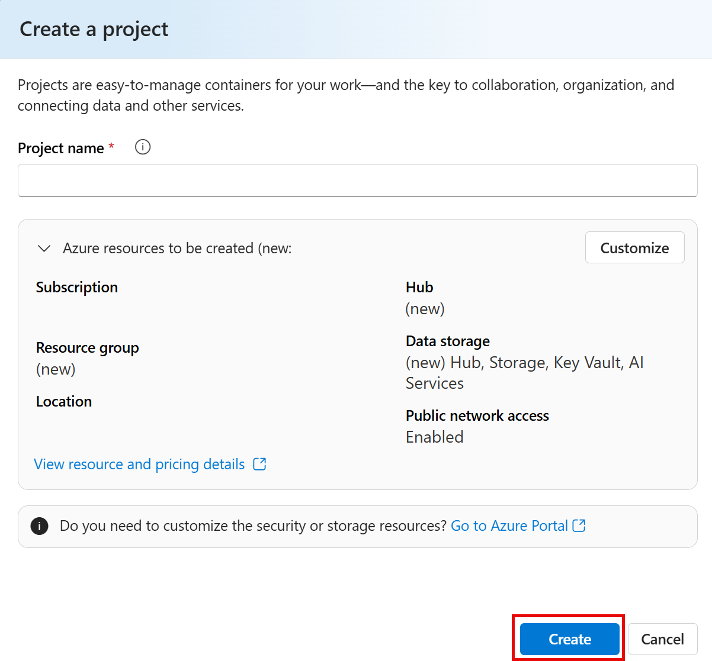

---
lab:
    title: 'Detect faces in Azure AI Foundry portal'
---

# Detect faces in Azure AI Foundry portal

Vision solutions often require AI to be able to detect human faces. Suppose the fictitious retail company Northwind Traders wants to locate where customers are standing in a store to best assist them. One way to accomplish this is to determine if there are any faces in the images, and if so, to return the bounding box coordinates that show their location.

In this exercise, you will use Azure AI Face in Azure AI Foundry portal, Microsoft's platform for creating intelligent applications, to detect faces with bounding boxes. 

## Create a project in Azure AI Foundry portal

1. In a browser tab, navigate to [Azure AI Foundry](https://ai.azure.com?azure-portal=true).

1. Sign in with your account. 

1. On the Azure AI Foundry portal home page, select **Create a project**. In Azure AI Foundry, projects are containers that help organize your work.  

    

1. On the *Create a project* pane, you will see a generated project name, which you can keep as-is. Depending on whether you have created a hub in the past, you will either see a list of *new* Azure resources to be created or a drop-down list of existing hubs. If you see the drop-down list of existing hubs, select *Create new hub*, create a unique name for your hub, and select *Next*.  
 
    

> **Important**: You will need an Azure AI services resouce provisioned in a specific location to complete the rest of the lab.

1. In the same *Create a project* pane, select **Customize** and select one of the following **Locations**: East US, France Central, Korea Central, West Europe, or West US to complete the rest of the lab. Then select **create**. 

1. Take note of the resources that are created: 
- Azure AI services
- Azure AI hub
- Azure AI project
- Storage account
- Key vault
- Resource group  
 
1. After the resources are created, you will be brought to your project's *Overview* page. On the left-hand menu on the screen, select **AI Services**.
 
      

1. On the *AI Services* page, select the *Vision + Document* tile to try out Azure AI Vision and Document capabilities.

    

## Detect faces in Azure AI Foundry portal 

1. On the *Vision + Document* page, scroll down and select **Face** and then select the **Detect faces in images** tile. 

1. Under the **Try It Out** subheading, select each of the sample images and observe the face detection data that is returned.

1. Now let's try with some of our own images. Select [**https://aka.ms/mslearn-detect-faces**](https://aka.ms/mslearn-detect-faces) to download **detect-faces.zip**. Then open the folder on your computer.

1. Locate the file named **store-camera-1.jpg**; which contains the following image:

    

1. Upload **store-camera-1.jpg** and review the face detection details that are returned.

1. Locate the file named **store-camera-2.jpg**; which contains the following image:

    

1. Upload **store-camera-2.jpg** and review the face detection details that are returned.

1. Locate the file named **store-camera-3.jpg**; which contains the following image:

    

1. Upload **store-camera-3.jpg** and review the face detection details that are returned. Notice how Azure AI Face did not detect the face that is obscured.

In this exercise you have explored how Azure AI services can detect faces in images. If you have time, feel free to try the sample images or some of your own images.

## Clean up

If you don’t intend to do more exercises, delete any resources that you no longer need. This avoids accruing any unnecessary costs.

1. Open the **Azure portal** at [https://portal.azure.com](https://portal.azure.com?azure-portal=true) and select the resource group that contains the resource you created.
1. Select the resource and select **Delete** and then **Yes** to confirm. The resource is then deleted.

## Learn more

To learn more about what you can do with this service, see the [Azure AI Face service page](https://learn.microsoft.com/azure/ai-services/computer-vision/overview-identity).
