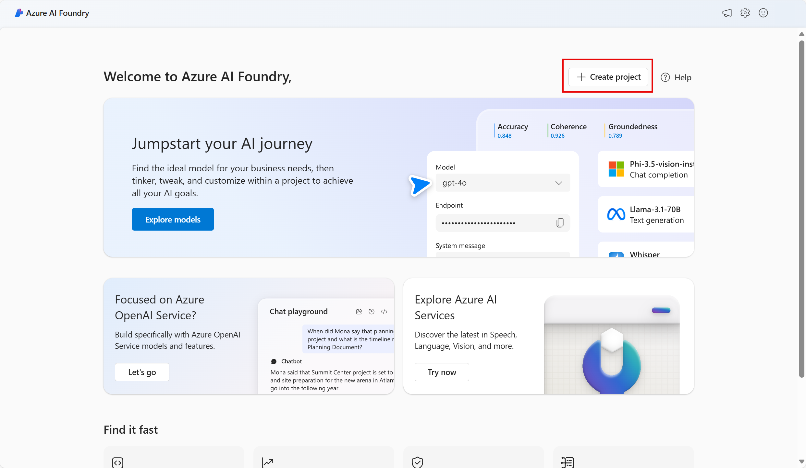

---
lab:
    title: 'Extract data from documents in Azure AI Foundry portal​'
---

# Extract data from documents in Azure AI Foundry portal

**Azure AI Document Intelligence** service enables you to analyze and extract information from forms and documents, then identify field names and data. 

How does Document Intelligence build upon optical character recognition (OCR)? While OCR can read printed or handwritten documents, OCR extracts text in an unstructured format which is difficult to store in a database or analyze. Document intelligence makes sense of the unstructured data by capturing the structure of the text, such as key/value pairs and information in tables. 

In this exercise, you will use Azure AI Document Intelligence's prebuilt models in Azure AI Foundry portal, Microsoft's platform for creating intelligent applications, to recognize data from a receipt. 

## Create a project in Azure AI Foundry portal

1. In a browser tab, navigate to [Azure AI Foundry](https://ai.azure.com?azure-portal=true).

1. Sign in with your account. 

1. On the Azure AI Foundry portal home page, select **Create a project**. In Azure AI Foundry, projects are containers that help organize your work.  

    

1. On the *Create a project* pane, you will see a generated project name, which you can keep as-is. Depending on whether you have created a hub in the past, you will either see a list of *new* Azure resources to be created or a drop-down list of existing hubs. If you see the drop-down list of existing hubs, select *Create new hub*, create a unique name for your hub, and select *Next*.  
 
    

> **Important**: You will need an Azure AI services resouce provisioned in a specific location to complete the rest of the lab.

1. In the same *Create a project* pane, select **Customize** and select one of the following **Locations**: East US, France Central, Korea Central, West Europe, or West US to complete the rest of the lab. Then select **create**. 

1. Take note of the resources that are created: 
- Azure AI services
- Azure AI hub
- Azure AI project
- Storage account
- Key vault
- Resource group  
 
1. After the resources are created, you will be brought to your project's *Overview* page. On the left-hand menu on the screen, select **AI Services**.
 
      

1. On the *AI Services* page, select the *Vision + Document* tile to try out Azure AI Document Intelligence capabilities.

    

## Analyze a receipt with Azure AI Document Intelligence in Azure AI Foundry 

You are now ready to analyze a receipt for the fictitious Northwind Traders retail company.

1. On the *Vision + Document* page, scroll down and select **Document**. Under *Prebuilt models for specific documents*, select the **Receipts** tile.

1. In the drop-down list under *Try it out*, note that your Azure AI services resource is selected. Leave it as-is.

1. On your computer, use [**https://aka.ms/mslearn-receipt**](https://aka.ms/mslearn-receipt) to open a sample image of a receipt. Save it in your Downloads folder or to your Desktop. 
 
1. In Azure AI Foundry, on the *Receipts* page, select **Browse for files** and navigate to the folder where you saved the picture. Select the picture of the receipt and then **Open**. The image appears on the left side of the screen.

    

1. On the right, select **Run analysis**.

1. When the analysis has run, the results are returned. Notice that the service has recognized specific data fields such as the merchant’s name, the address, phone number, and the transaction date and time, as well as the line items, subtotal, tax, and total amounts. Next to each field is a percentage probability that the field is correct.

In this exercise you have used Azure AI Document Intelligence's prebuilt receipts model in Azure AI Foundry portal. From the results that were returned, you saw how Document Intelligence was able to identify specific fields, enabling data from everyday documents to be more easily processed. Before you close the demo, why not try some of the sample receipts, including those in different languages?

## Clean up

If you don’t intend to do more exercises, delete any resources that you no longer need. This avoids accruing any unnecessary costs.

1. Open the [Azure portal]( https://portal.azure.com) and select the resource group that contains the resource you created.
1. Select the resource and select **Delete** and then **Yes** to confirm. The resource is then deleted.

## Learn more

This exercise demonstrated only some of the capabilities of the AI Document Intelligence service. To learn more about what you can do with this service, see the [Document Intelligence](https://learn.microsoft.com/azure/ai-services/document-intelligence/overview?view=doc-intel-3.1.0) page.
